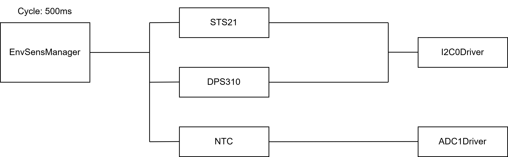

# Components::EnvSensManager

Component for SBC diagnostics

## Usage Examples
Add usage examples here

### Diagrams
Add diagrams here

### Typical Usage

## Class Diagram
Add a class diagram here

## Port Descriptions
| Name | Description |
|---|---|
|---|---|

## Component States
Add component states in the chart below
| Name | Description |
|---|---|
|---|---|

## Sequence Diagrams
Add sequence diagrams here

## Parameters
| Name | Description |
|---|---|
|---|---|

## Commands
| Name | Description |
|---|---|
|---|---|

## Events
| Name | Description |
|---|---|
|---|---|

## Telemetry
| Name | Description |
|---|---|
|---|---|

## Unit Tests
Add unit test descriptions in the chart below
| Name | Description | Output | Coverage |
|---|---|---|---|
|testEnvSensManagerAveraging|Test provide average temperature value obtained from different sensors and a separate temperature value obtained from each individual sensor|Passed|---|
|testEnvSensManagerInvalidData|Testing that if one sensor give us invalid data average value will be invalid, data from that sensor also will be invalid|Passed|---|

## Requirements
| Name | Description | Validation |
|---|---|---|
|EnvSensManagerReq1|The driver must provide access to the readings of the environmental sensors installed on the single board computer, namely: digital temperature sensor STS21, analog temperature sensor NTC, atmospheric pressure and temperature sensor DPS31.|testDPS310Temperature, testDPS310ColdTemperature, testDPS310Pressure, testNTCGetTemperature,testNTCColdTemperature, testNTCPolynomTemperature, testNTCPolynomColdTemperature, testSTS21Temperature, testSTS21ColdTemperature|
|EnvSensManagerReq2|To access the sensor data, the driver must interact with the following middle-level drivers: 1. STS21 - digital temperature sensor driver; 2. NTC - analog temperature sensor driver; 3. DPS310 - digital atmospheric pressure and temperature sensor driver.|testEnvSensManagerInvalidData, testEnvSensManagerAveraging|
|EnvSensManagerReq3|The driver must provide both a consistent average temperature value obtained from different sensors and a separate temperature value obtained from each individual sensor (analog and digital).|testEnvSensManagerAveraging|
|EnvSensManagerReq4|The driver must support two-point calibration of each individual sensor.|configure functions inside drivers for DPS310,NTC,STS21|
|EnvSensManagerReq5|The driver must diagnose the state of each individual sensor and, in the event of an exchange error with the sensor, reset the "quality" indicator of the corresponding indicator.|testEnvSensManagerInvalidData|

## Change Log
| Date | Description |
|---|---|
|---| Initial Draft |