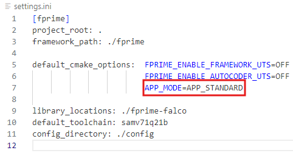
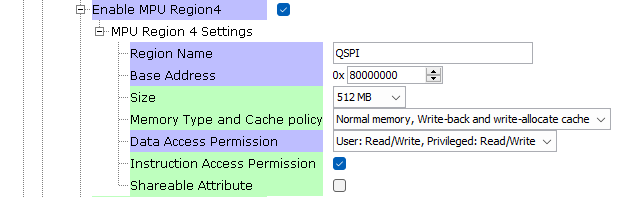
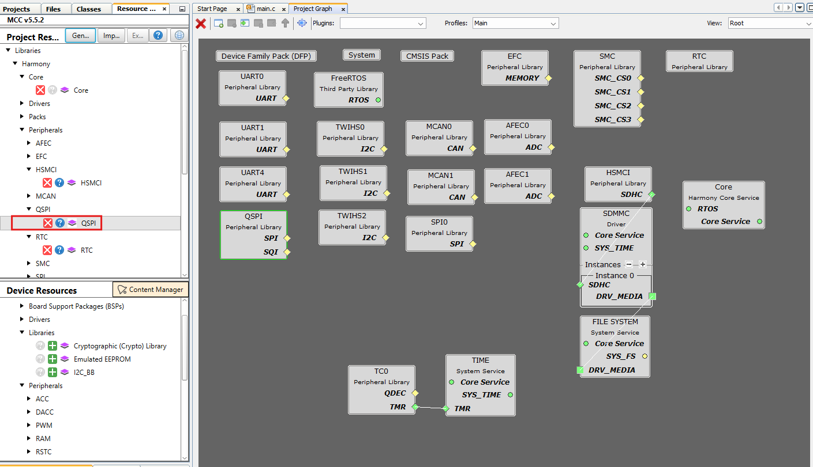
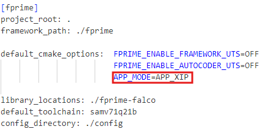

# FalcoPrime Application

1. In settings.ini choose APP_MODE to be APP_STANDARD:

# FalcoPrime Application for XIP

If this deployment is supposed to be executed from external flash memory (XIP) the following things need to be done:

1. Ensure that that QSPI region is configured as Normal memory and it is cachaeable:

2. Remove QSPI initialization:

3. Ensure that the following components are not used in topology: QspiDriver, NORDirver, NORManager

4. In settings.ini choose APP_MODE as APP_XIP:

