# FPrime_SBC F' project

## WSL installation and usbipd configuration (for Windows users)
1. Install WSL and 22.04 LTS

Commands needed:
- WSL installation:
```
wsl --install --no-distribution
```
- Install Ubuntu 22.04 LTS from the [Windows App Store](https://apps.microsoft.com/detail/9pn20msr04dw?ref=developerinsider.co&hl=en-us&gl=UA)

- List available WSL distributions:
```
wsl -l -v
```
- Set default distribution:
```
wsl --set-default Ubuntu-22.04
```
- Set default WSL version to be 2:
```
wsl --set-default-version 2
```
 
2. In Microsoft Store open and finish configuration by setting user name and password

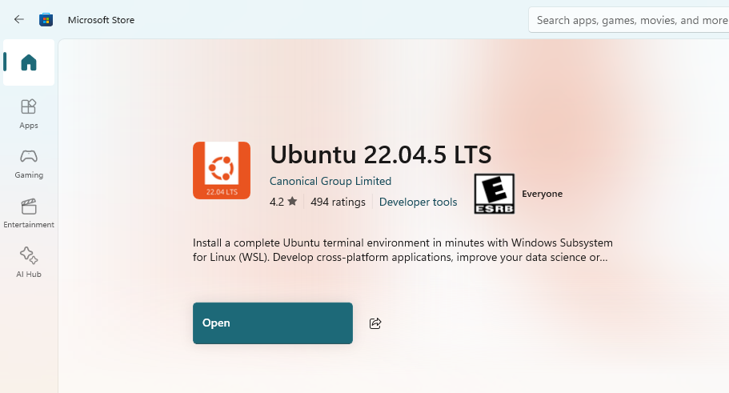

Run from WSL:
```
sudo apt-get update
```
```
sudo apt-get upgrade
```
3. From Windows Powershell verify that WSL2 is used and Ubuntu-22.04 is set as default (* near name):
```
wsl -l -v
```
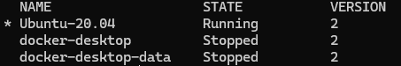

4. To make USB device accessible and visible to WSL install usbipd-win on Windows by downloading and starting msi of the latest [release](https://github.com/dorssel/usbipd-win/releases)
5. Install usbipd-win on WSL. To do this open Powershell or Terminal on Windows and run the command: 
```
winget install usbipd
```
6. Open PowerShell command prompt with administrator right and then type in the command:
```
usbipd list
```
All USB devices from windows will be found and their attach state will be shown. Find J-Link driver BUSID

7. To access the device from local Windows on WSL, the user needs to bind this device to WSL.
Open PowerShell command prompt with administrator right and then type in the command:
```
usbipd bind -b <BUSID>
```

8. After binding, open the Powershell command prompt with regular user permissions. Attach the device to WSL with command:
```
usbipd attach --wsl --busid <BUISD>
```

9. From WSL type command:
```
dmesg | tail
```
 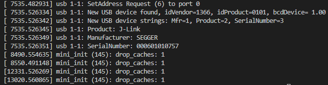

10. From Windows type:
```
usbipd list
```
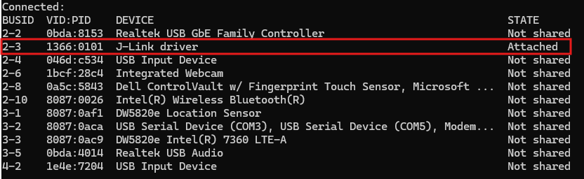

J-link is attached to WSL now.

## Build the project

1. Install [J-Link Software and Documentation Pack](https://www.segger.com/downloads/jlink/#J-LinkSoftwareAndDocumentationPack)

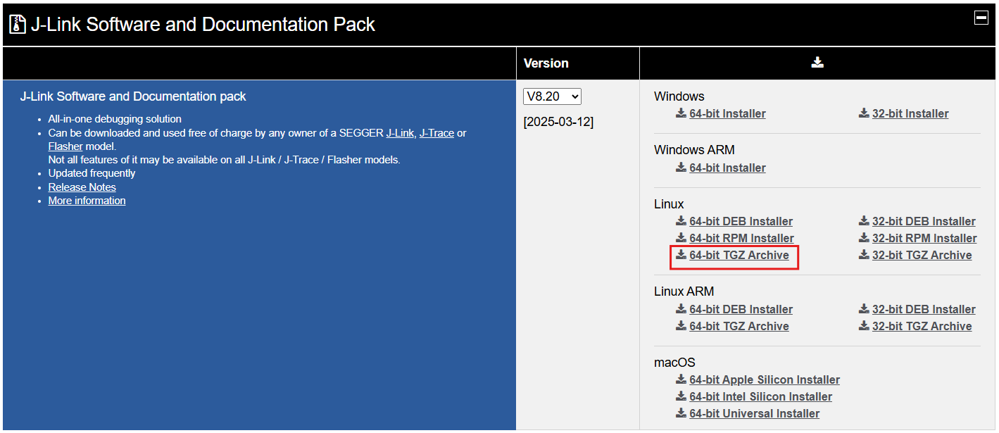

2. Install [arm toolchain 12.3rel1](https://developer.arm.com/downloads/-/arm-gnu-toolchain-downloads/12-3-rel1)

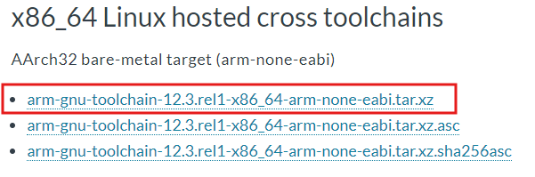

3. (for Windows users) From WSL:

Create folder Downloads:
```
cd
```
```
mkdir Downloads
```
Move downloaded archives from Windows to WSL’s Donwloads folder
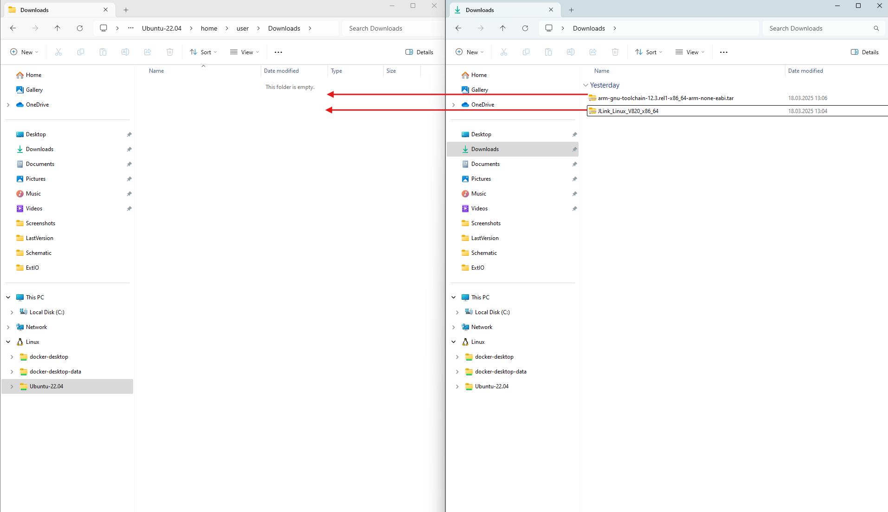

4. Unpack downloaded archives:

Unarchive JLink packages:
```
sudo tar -xvzf /home/$USER/Downloads/JLink_Linux_V820_x86_64.tgz -C /opt
```
Copy rules:
```
sudo cp /opt/JLink_Linux_V820_x86_64/99-jlink.rules /etc/udev/rules.d/99-jlink.rules
```
Unarchive ARM toolchain:
```
sudo tar xf /home/$USER/Downloads/arm-gnu-toolchain-12.3.rel1-x86_64-arm-none-eabi.tar.xz -C /opt
```

5. Install libncursesw5 and Python 3.8

Install libncursesw5:
```
sudo apt-get install libncursesw5
```

Install Python3.8 (based on [guide](https://gist.github.com/basaks/0fad2f9929a4a9e719512c37c766b05f)):

Install dependencies:
```
sudo apt install tar build-essential checkinstall  libreadline-dev \
	libncursesw5-dev libssl-dev libsqlite3-dev tk-dev libgdbm-dev libc6-dev \
	libbz2-dev openssl libffi-dev
```
Download and untar the desired version: 
```
mkdir -p $HOME/opt
```
```
cd $HOME/opt
```
```
curl -O https://www.python.org/ftp/python/3.8.9/Python-3.8.9.tgz
```
```
tar -xzf Python-3.8.9.tgz
```
Install python3.8 while keeping python3.10 as the default python3 version on ubuntu 22.04:
```
cd Python-3.8.9/
```
```
./configure --enable-shared --enable-optimizations --prefix=/usr/local LDFLAGS="-Wl,--rpath=/usr/local/lib"
```
```
sudo make altinstall
```
Check it was installed properly:
```
python3.8 -V
```

6. Ensure that arm-none-eabi-gdb works properly, run:
```
cd /opt/arm-gnu-toolchain-12.3.rel1-x86_64-arm-none-eabi/bin/
```
```
./arm-none-eabi-gdb --version
```
The version of gdb should be displayed:

_GNU gdb (Arm GNU Toolchain 12.3.Rel1 (Build arm-12.35)) 13.2.90.20230627-git
Copyright (C) 2023 Free Software Foundation, Inc._


7. Ensure the system requirements are installed:
```
sudo apt install git cmake default-jre python3 python3-pip python3-venv
```

8. Make sure Cmake 3.30 is installed
```
sudo apt remove cmake
```
```
sudo apt autoremove
```
```
cd
```
```
cd Downloads
```
```
wget https://github.com/Kitware/CMake/releases/download/v3.30.0/cmake-3.30.0-linux-x86_64.tar.gz
```
```
sudo mkdir /opt/cmake-3.30.0
```
```
sudo tar -xzf cmake-3.30.0-linux-x86_64.tar.gz -C /opt/cmake-3.30.0 --strip-components=1
```

Open ~/.bashrc using any editor.

Add to the end of file the following line: 
```
export PATH=/opt/cmake-3.30.0/bin:$PATH
```

Save the file and close the editor.

Apply the changes to your current shell session:
```
source ~/.bashrc
```

Check the Cmake version:
```
cmake --version
```

It should now display cmake version 3.30.0.

9. Download the project: 
```
cd
```
```
git clone https://github.com/Gonta01/falco.git
```
```
cd fprime_sbc
```
Checkout branch:
```
git checkout development
```
Update submodules recursively:
```
git submodule update --init --recursive
```

10. Ensure a virtual environment for this project has been created and activated 
```
python3 -m venv fprime-venv
```
```
source fprime-venv/bin/activate
```
If you want to switch projects or leave your virtual environment, deactivate the environment (don't do this if you want generate and build your project): 
```
deactivate
```
11. Install the required F´ tools versions

Inside project run: 
```
pip install -r fprime/requirements.txt
```

12. Generate and build project:
```
fprime-util generate
```
```
fprime-util build
```

13. For unit test build:
```
sudo apt install gcc-12
```
```
sudo ln -s -f /usr/bin/gcc-12 /usr/bin/gcc
```
```
sudo apt install g++-12
```
```
sudo ln -s -f /usr/bin/g++-12 /usr/bin/g++
```

## Visual Studio Code configuration
1. Install [Visual Studio Code](https://code.visualstudio.com/)
2. (For Windows users): Install [WSL Extension](https://marketplace.visualstudio.com/items?itemName=ms-vscode-remote.remote-wsl)
3. (For Windows users): Activate WSL in VS Code (Press F1 in VSCode and type wsl. Choose "Connect to WSL". New window will be opened which is connected to WSL Ubuntu) 
4. Install Visual Studio Code extensions:

[Cortex-Debug extension](https://marketplace.visualstudio.com/items?itemName=marus25.cortex-debug)

[C/C++ Extension Pack](https://marketplace.visualstudio.com/items?itemName=ms-vscode.cpptools-extension-pack)

[Cmake Tools](https://marketplace.visualstudio.com/items?itemName=ms-vscode.cmake-tools)

[FPP](https://marketplace.visualstudio.com/items?itemName=jet-propulsion-laboratory.fpp)

5. Add c_cpp_properties.json and launch.json files to your project

To create  c_cpp_properties.json in VSCode:
```
F1 → type config→ and Select „C/C++:Edit Configurations(JSON)”
```
To create launch.json:
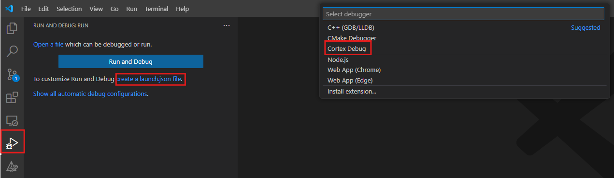

Working example of  files:

**c_cpp_properties.json**
```
{
    "configurations": [
        {
            "name": "Linux",
            "includePath": [
                "${workspaceFolder}/**"
            ],
            "defines": [
            "\"_DEBUG\",",
            "\"UNICODE\",",
            "\"_UNICODE\""
            ],
            "compilerPath": "/opt/arm-gnu-toolchain-12.3.rel1-x86_64-arm-none-eabi/bin/arm-none-eabi-g++",
            "cStandard": "c17",
            "cppStandard": "gnu++17",
            "intelliSenseMode": "linux-gcc-x64"
        }
    ],
    "version": 4
}
```

**launch.json**
```
{
    // Use IntelliSense to learn about possible attributes.
    // Hover to view descriptions of existing attributes.
    // For more information, visit: https://go.microsoft.com/fwlink/?linkid=830387
    "version": "0.2.0",
    "configurations": [
        {
            "type": "cortex-debug",
            "request": "launch",
            "name": "Debug J-Link",
            "cwd": "${workspaceRoot}",
            "executable": "${workspaceRoot}/build-artifacts/samv71q21b/FalcoPrime/bin/FalcoPrime.elf",
            "serverpath": "/opt/JLink_Linux_V820_x86_64/JLinkGDBServerCLExe",
            "serverArgs": ["-speed", "4000", "-nogui", "-singlerun"],
            "servertype": "jlink",
            "device": "ATSAMV71Q21B",
            "interface": "swd",
            "serialNumber": "", //If you have more than one J-Link probe, add the serial number here.
            "runToEntryPoint": "main",
            "armToolchainPath": "/opt/arm-gnu-toolchain-12.3.rel1-x86_64-arm-none-eabi/bin",
            "svdFile": "${workspaceRoot}/ATSAMV71Q21.svd", 
            "showDevDebugOutput": "both"
        }
    ]
}
```

Take special note to line:
```
"serverpath": "/opt/JLink_Linux_V820_x86_64/JLinkGDBServerCLExe",
```
V820 should be modified if another JLink version is used.

6. Debug with J-Link:

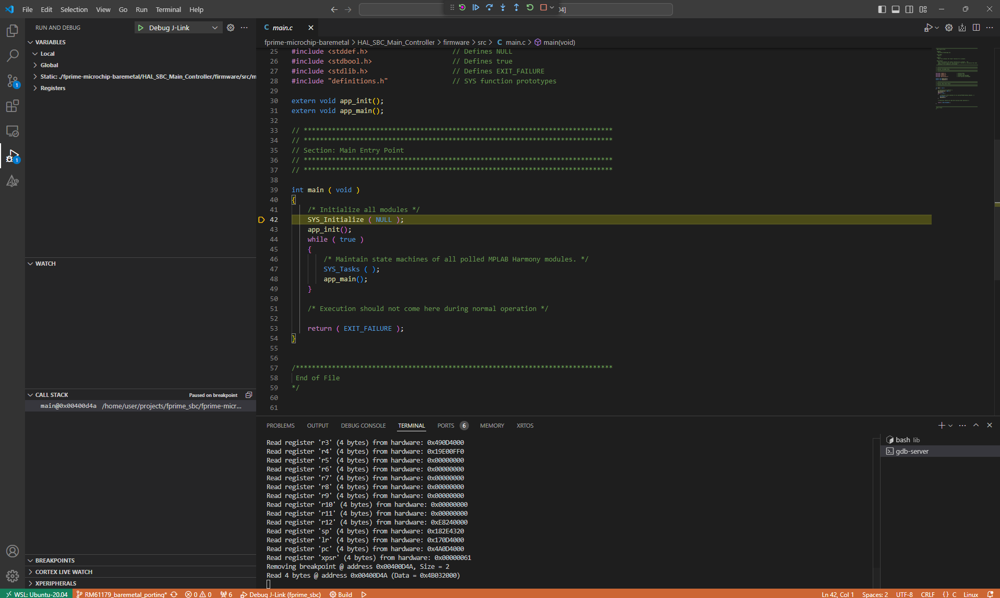

## L-Tek SWDAP configuration
On Wsl side:

1. PyOCD installation
- run command:
```
pip install pyocd
```

2. Insert rules (this stage based on [forum discussion](https://askubuntu.com/questions/1495057/openocd-unable-to-find-a-matching-cmsis-dap-device-in-wsl))
- run command:
```
cd /etc/udev/rules.d
```
- run command:
```
sudo vi 60-openocd.rules
```
- paste inside file (press I to enter insert mode in Vim):
```
ACTION!="add|change", GOTO="openocd_rules_end"
SUBSYSTEM=="gpio", MODE="0660", GROUP="plugdev", TAG+="uaccess"
SUBSYSTEM!="usb|tty|hidraw", GOTO="openocd_rules_end"
ATTRS{idVendor}=="03eb", ATTRS{idProduct}=="2111", MODE="660", GROUP="plugdev", TAG+="uaccess"
# CMSIS-DAP compatible adapters
ATTRS{product}=="*CMSIS-DAP*", MODE="660", GROUP="plugdev", TAG+="uaccess"
```
- Press Esc and then type: “wq”

3. Reboot wsl
- run command:
```
sudo reboot
```
- close VSCode
- start Ubuntu 22.04.6 LTS from Windows Store
- open VSCode

4. Attach L-Tek SWDAP device to WSL with the usage of usbipd

(Instruction was described previously)

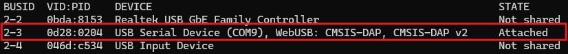

5. Check that device is connected:
- run command:
```
pyocd list -p
```
- you should see:

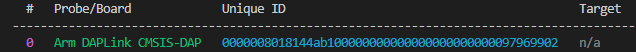

6. Find Microchip ATSAMV71 pack:
- run command:
```
pyocd pack find atsamv71
```
- you should see (On “Installed” column there may be False at this stage):

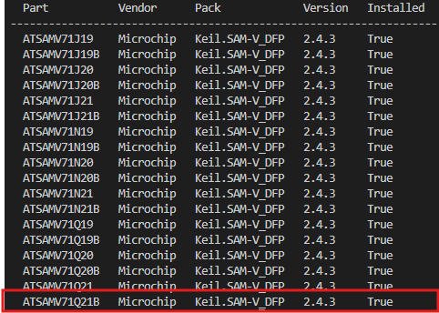

7. Install Microchip ATSAMV71 pack:
- run command:
```
pyocd pack install ATSAMV71Q21B
```

8. Check that ATSAMV71Q21B is on the list:
- run command:
```
pyocd list -t
```
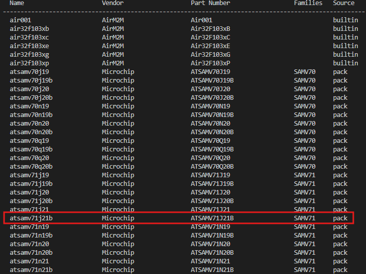

9. Modify launch.json has the following appearance:

**launch.json**
```
{
    // Use IntelliSense to learn about possible attributes.
    // Hover to view descriptions of existing attributes.
    // For more information, visit: https://go.microsoft.com/fwlink/?linkid=830387
    "version": "0.2.0",
    "configurations": [
        {
            "cwd": "${workspaceFolder}",
            "executable": "${workspaceRoot}/build-artifacts/samv71q21b/FalcoPrime/bin/FalcoPrime.elf",
            "name": "Debug with PyOCD",
            "request": "launch",
            "type": "cortex-debug",
            "runToEntryPoint": "main",
            "showDevDebugOutput": "none",
            "servertype": "pyocd",
            "serverArgs": ["-t", "ATSAMV71Q21B"],
            "device": "ATSAMV71Q21B",
            "interface": "swd",
            "armToolchainPath": "/opt/arm-gnu-toolchain-12.3.rel1-x86_64-arm-none-eabi/bin",
            "svdFile": "${workspaceRoot}/ATSAMV71Q21.svd"
        },
        {
            "type": "cortex-debug",
            "request": "launch",
            "name": "Debug J-Link",
            "cwd": "${workspaceRoot}",
            "executable": "${workspaceRoot}/build-artifacts/samv71q21b/FalcoPrime/bin/FalcoPrime.elf",
            "serverpath": "/opt/JLink_Linux_V820_x86_64/JLinkGDBServerCLExe",
            "serverArgs": ["-speed", "4000", "-nogui", "-singlerun"],
            "servertype": "jlink",
            "device": "ATSAMV71Q21B",
            "interface": "swd",
            "serialNumber": "", //If you have more than one J-Link probe, add the serial number here.
            "runToEntryPoint": "main",
            "armToolchainPath": "/opt/arm-gnu-toolchain-12.3.rel1-x86_64-arm-none-eabi/bin",
            "svdFile": "${workspaceRoot}/ATSAMV71Q21.svd", 
            "showDevDebugOutput": "both"
        }
    ]
}
```

10. Start debugging session:

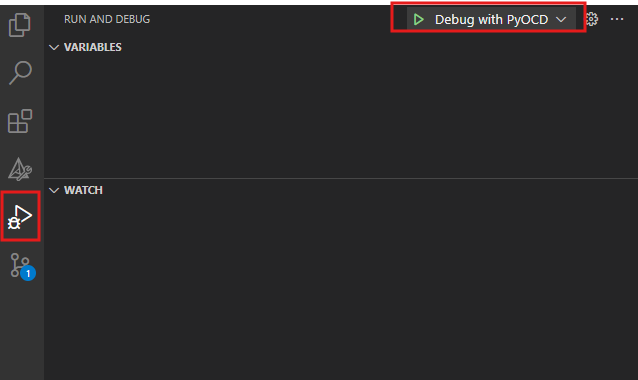
--------------------------------------------
Optional commands (if needed):
- To start gdb in CLI:
- Run command:
```
pyocd gdb -t ATSAMV71Q21B
```
To erase chip:
- Run command:
```
pyocd erase -t ATSAMV71Q21B -c 
```

## Topology visualizer

Topology illustration is obtained with the usage of [fprime-layout](https://github.com/fprime-community/fprime-layout) and [fprime-visual](https://github.com/fprime-community/fprime-visual)

1. F Prime Layout (FPL) installation

- install sbt:
```
echo "deb https://repo.scala-sbt.org/scalasbt/debian all main" | sudo tee /etc/apt/sources.list.d/sbt.list
echo "deb https://repo.scala-sbt.org/scalasbt/debian /" | sudo tee /etc/apt/sources.list.d/sbt_old.list
curl -sL "https://keyserver.ubuntu.com/pks/lookup?op=get&search=0x2EE0EA64E40A89B84B2DF73499E82A75642AC823" | sudo apt-key add
sudo apt-get update
sudo apt-get install sbt
```
- install FPL:
```
git clone https://github.com/fprime-community/fprime-layout.git
```
- inside fprime-layout:
```
./install
```
- Put FPL tools to shell path:
```
export FPL_INSTALL_DIR=[path-to-fpl-install-dir]
export PATH=$PATH:$FPL_INSTALL_DIR
```
it may look like:
```
export FPL_INSTALL_DIR=/home/user/fprime-layout/bin
export PATH=$PATH:$FPL_INSTALL_DIR
```
- Put FPL tools to shell path:
Open ~/.bashrc using any editor:

Add to the end of file the following line: 
```
export FPL_INSTALL_DIR=[path-to-fpl-install-dir]
export PATH=$PATH:$FPL_INSTALL_DIR
```

Save the file and close the editor.

Apply the changes to your current shell session:
```
source ~/.bashrc
```

2. F Prime Visualizer (FPV) installation

FPV is part of fprime-venv so it's enough to run from project root:
```
source fprime-venv/bin/activate
```

3. Files conversion (it is shown on particular example, from root of the project)
```
mkdir top
```
```
fpl-convert-xml build-fprime-automatic-samv71q21b/FalcoPrime/Top/FalcoPrimeTopologyAppAi.xml > top/topology.txt
```
```
fpl-layout < top/topology.txt > top/topology.json
```

4. Visualisation
```
fprime-visual --source-dir top/
```

Optional:
If you want to seperate topology in subtopologies and then visualize them, after stage 2 run:
```
fpl-extract-xml -d top build-fprime-automatic-samv71q21b/FalcoPrime/Top/FalcoPrimeTopologyAppAi.xml 
```
Then for each generated file do step 3.
After this do step 4.


## FAQ
### 1. How to connect j-link to WSL?

I. Open PowerShell command prompt with administrator right and then type in the command:
```
usbipd list
```
All USB devices from windows will be found and their attach state will be shown. Find J-Link driver <BUSID>

II. To access the device from local Windows on WSL, the user needs to bind this device to WSL.
Open PowerShell command prompt with administrator right and then type in the command:
```
usbipd bind -b <BUSID>
```

III. After binding, open the Powershell command prompt with regular user permissions. Attach the device to WSL with command:
```
usbipd attach --wsl --busid <BUISD>
```

IV. From WSL type command:
```
dmesg | tail
```
 

V. From Windows type:
```
 usbipd list
```


J-link is attached to WSL now.

### 2. How to work with F' project?
I. Ensure a virtual environment for this project has been created and activated 
```
source fprime-venv/bin/activate
```
II. Generate project 
```
fprime-util generate
```
III. Build project 
```
fprime-util build
```
IV. Clean project 
```
fprime-util purge
```

!IMPORTANT NOTE:
If pin configuration was modified through MPLAB configurator then need to use I2C0BusStuckParser.py, I2C1BusStuckParser.py and I2C2BusStuckParser.py before step III and insert generated functions into I2c0Driver.cpp, I2c1Driver.cpp and I2c2Driver.cpp accordingly.

### 3. How to test project with GDS?
I. If WSL is used, ensure that UART cable is connected to WSL.

II. Activate fprime-gds

In case if FalcoPrime deployment was built, use command:
```
fprime-gds -n --dictionary ./build-artifacts/samv71q21b/FalcoPrime/dict/FalcoPrimeTopologyAppDictionary.xml --comm-adapter uart --uart-device /dev/ttyUSB0 --uart-baud 115200
```

### 4. How to visualize Topology?
- create folder
```
mkdir top
```
- extract subtopolgies (optional)
```
fpl-extract-xml -d top build-fprime-automatic-samv71q21b/FalcoPrime/Top/FalcoPrimeTopologyAppAi.xml 
```
- convert xml into txt:
```
fpl-convert-xml build-fprime-automatic-samv71q21b/FalcoPrime/Top/FalcoPrimeTopologyAppAi.xml > top/topology.txt
```
- converts txt into json:
```
fpl-layout < top/topology.txt > top/topology.json
```
- visualize:
```
fprime-visual --source-dir top/
```

## References
[The F´ Website](https://fprime.jpl.nasa.gov)

[J-Link Visual Studio Code](https://wiki.segger.com/J-Link_Visual_Studio_Code)