# FreeIMU usage guide (from microcontroller side) 
To create minimal working software for IMU calibration need to implement handling of the following commands received through UART from FreeIMU calibration software: 
Command ‘v’ - FreeIMU expects to receive version of hardware. It could be any string. For example, “Falco v1”. 
Command ‘b’ and following count byte.   

Example of code: 
```
if (isSamplingStarted) { 
     this->getData_out(0, imuData); 
     calibrationData = imuData.getCalibration(); 
     sendRawDataForCalibration(calibrationData); 
     samplingCnt++; 
     if (samplingCnt == maxCount) { 
        samplingCnt = 0; 
        isSamplingStarted = false; 
     } 
   } 
    etl::string<8> my_string = ""; 
    my_string.clear(); 
    Fw::Buffer fwBuffer(reinterpret_cast<U8*>(my_string.data()), 1); 
    U32 numOfBytes = this->read_out(0, fwBuffer, 10); 
    if (numOfBytes > 0) { 
      constexpr uint8_t versionCmd = 'v'; 
      if (*my_string.begin() == versionCmd) { 
        sendVersionAnswer(); 
      } 
      constexpr uint8_t sendRawDataCmd = 'b'; 
      if (*my_string.begin() == sendRawDataCmd) { 
        etl::string<8> count_string = ""; 
        count_string.clear(); 
        Fw::Buffer countBuffer(reinterpret_cast<U8*>(count_string.data()), 1); 
        constexpr U32 maxAttempts = 5; 
        U32 numOfAttempts = 0; 
        while (true) { 
          if (numOfAttempts >= maxAttempts) { 
            break; 
          } 
          U32 numOfReadBytes = this->read_out(0, countBuffer, 10); 
          if (numOfReadBytes > 0) { 
            maxCount = *count_string.begin(); 
            break; 
          } 
          numOfAttempts++; 
        } 
        isSamplingStarted = true; 
      } 
    } 

bool Calibration::sendRawDataForCalibration(Drv::IMU::CalibrationData& rawData) { 
    etl::array<U8, 20> rawDataBuffer; 
    rawDataBuffer.at(0) = (rawData.getAccelX() & 0xFF); 
    rawDataBuffer.at(1) = (rawData.getAccelX() >> 8) & 0xFF; 
    rawDataBuffer.at(2) = (rawData.getAccelY() & 0xFF); 
    rawDataBuffer.at(3) = (rawData.getAccelY() >> 8) & 0xFF; 
    rawDataBuffer.at(4) = (rawData.getAccelZ() & 0xFF); 
    rawDataBuffer.at(5) = (rawData.getAccelZ() >> 8) & 0xFF; 
    rawDataBuffer.at(6) = (rawData.getGyroX() & 0xFF); 
    rawDataBuffer.at(7) = (rawData.getGyroX() >> 8) & 0xFF; 
    rawDataBuffer.at(8) = (rawData.getGyroY() & 0xFF); 
    rawDataBuffer.at(9) = (rawData.getGyroY() >> 8) & 0xFF; 
    rawDataBuffer.at(10) = (rawData.getGyroZ() & 0xFF); 
    rawDataBuffer.at(11) = (rawData.getGyroZ() >> 8) & 0xFF; 
    rawDataBuffer.at(12) = (rawData.getMagnX() & 0xFF); 
    rawDataBuffer.at(13) = (rawData.getMagnX() >> 8) & 0xFF; 
    rawDataBuffer.at(14) = (rawData.getMagnY() & 0xFF); 
    rawDataBuffer.at(15) = (rawData.getMagnY() >> 8) & 0xFF; 
    rawDataBuffer.at(16) = (rawData.getMagnZ() & 0xFF); 
    rawDataBuffer.at(17) = (rawData.getMagnZ() >> 8) & 0xFF; 
    rawDataBuffer.at(18) = '\r'; 
    rawDataBuffer.at(19) = '\n'; 
    Fw::Buffer fwBuffer(rawDataBuffer.data(), rawDataBuffer.size()); 
    Drv::UART::WriteStatus writeStatus = this->write_out(0, fwBuffer, 10); 
    return true; 
  } 

  bool Calibration::sendVersionAnswer() { 
    etl::string<128> my_string; 
    my_string.clear(); 
    my_string.append("Falco v1"); 
    my_string.append("\n"); 
    Fw::Buffer fwBuffer(reinterpret_cast<U8*>(my_string.data()), my_string.size()); 
    Drv::UART::WriteStatus writeStatus = this->write_out(0, fwBuffer, 10); 
    return true; 
  } 
```
# FreeIMU usage guide (from person computer side) 

1) Git clone FreeIMU GUI: https://github.com/davPo/FreeIMU-GUI 
2) In cal_gui.py should modify the following line: 
word = 4  
Change to 
word = 2 

Word should be 2 if raw measurements are represented as U16. 
Word should be 4 if raw measurements are represented as U32. 

3) In cal_lib.py at the very beginning write down the following lines: 
def patch_asscalar(a): 
return a.item()  
setattr(numpy, "asscalar", patch_asscalar) 

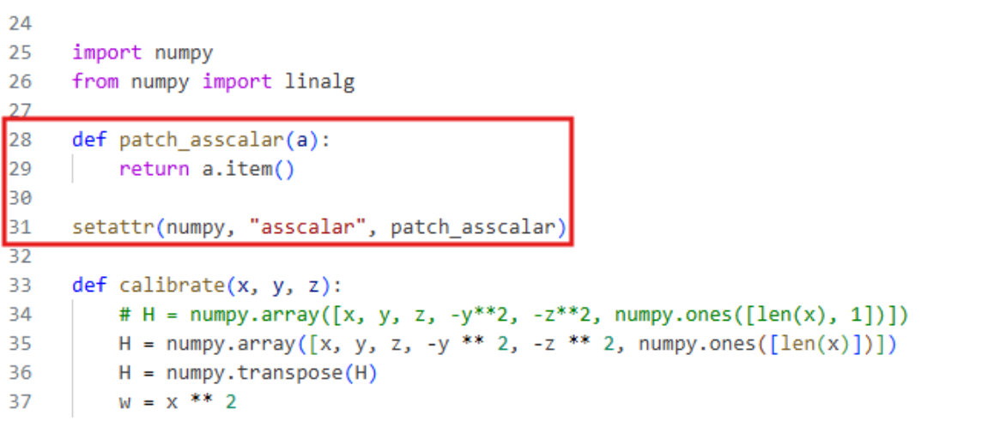

4) Run python program: 
python3 cal_gui.py 

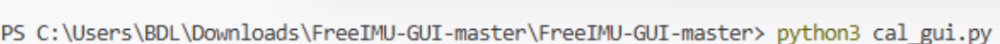

5) User interface looks as follows: 

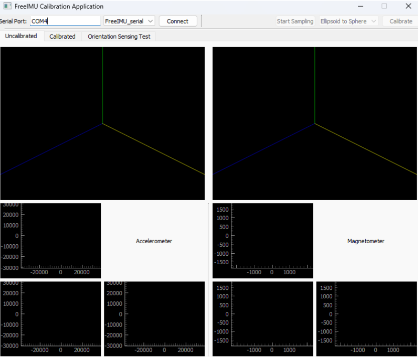

6) Connect to your board by choosing the correct serial port and by clicking “Connect” button. 
7) After board is successfully connected perform the following moves with your board: 

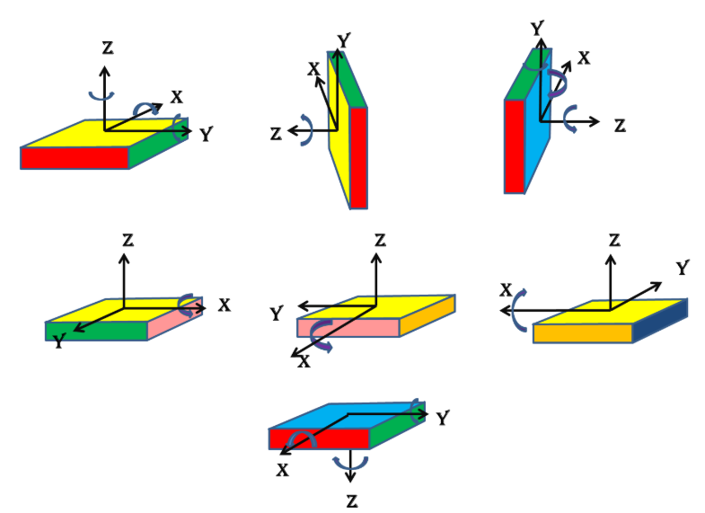

As a result, the following data should be obtained:  

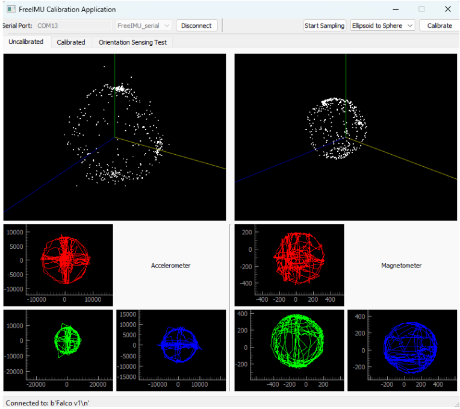

8) Push calibrate button calibration parameters will be obtained: 

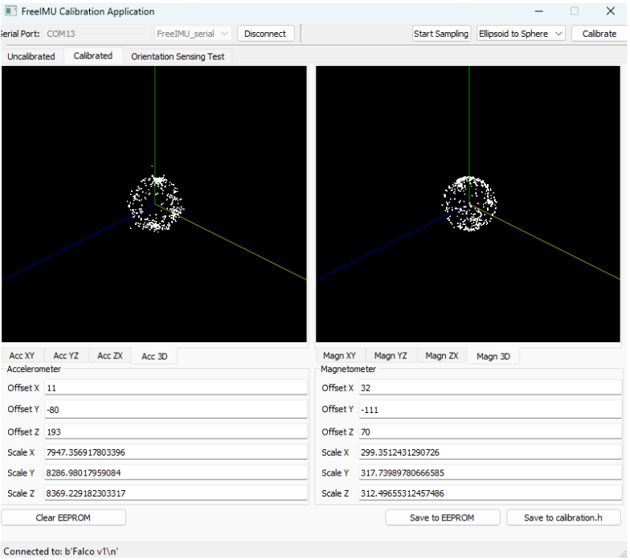

9) Apply calibrated values in the firmware for microcontroller: 

CalibratedValue(X,Y,Z) = (UncalibratedValue(X,Y,Z) - Offset(X,Y,Z)) / Scale(X,Y,Z) 

Example: 

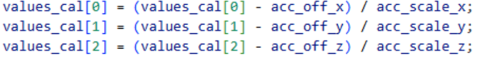

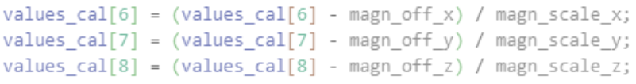


# Magneto usage guide
1) Record magnetometer data in specified units (for example microTesla); 

2) Transmit it or initially create it in some “.txt” file.  

The format of data representation is: (MagnX MagnY MagnZ) 

22.950 -18.000 52.350 

24.150 -19.500 53.100 

23.550 -18.150 52.200 

3) Get magnetic field norm (or Total intensity) values from NOAA or BGS sites: 

NOAA: https://www.ngdc.noaa.gov/geomag/calculators/magcalc.shtml#igrfwmm 

BGS:  http://www.geomag.bgs.ac.uk/data_service/models_compass/wmm_calc.html 

4) Provide magneto software with magnetic field norm and “.txt” file. 

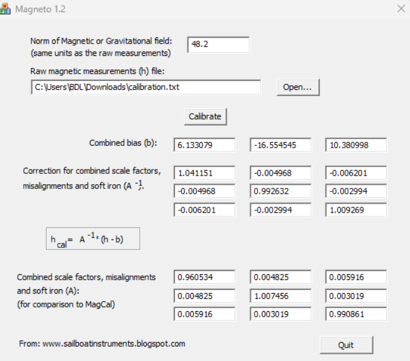

5) Use obtained parameters in source code: 

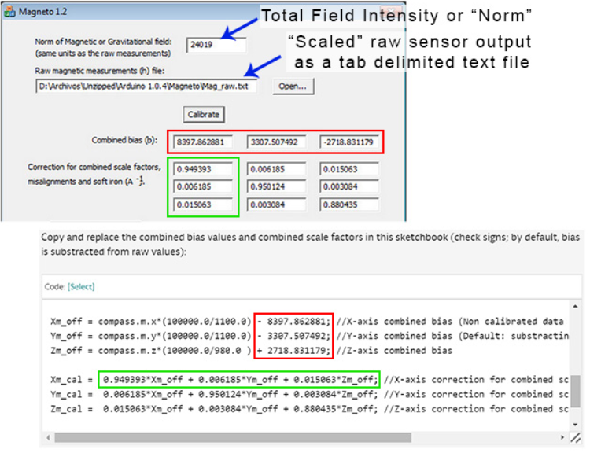

6) The same procedure may be conducted for accelerometer calibration: (make sure that Norm of Gravtional field and provided measurements are of the units!) 

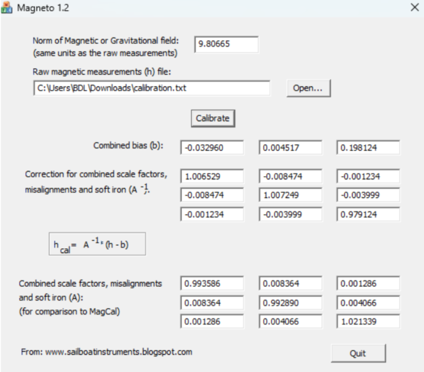
