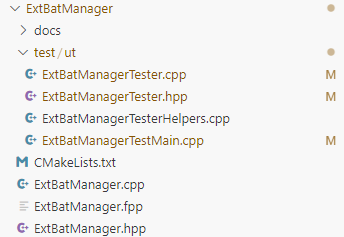
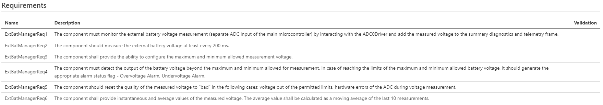
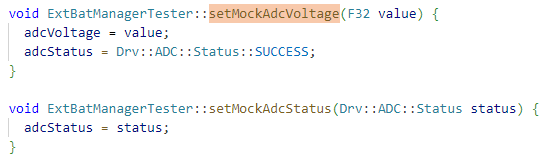
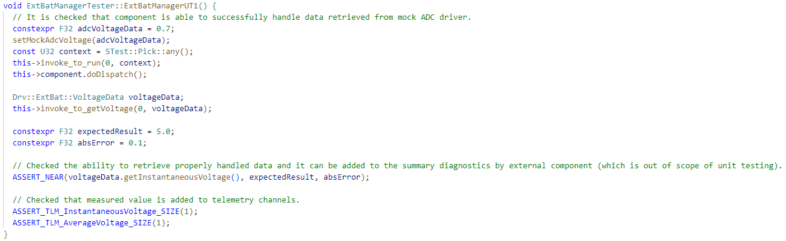
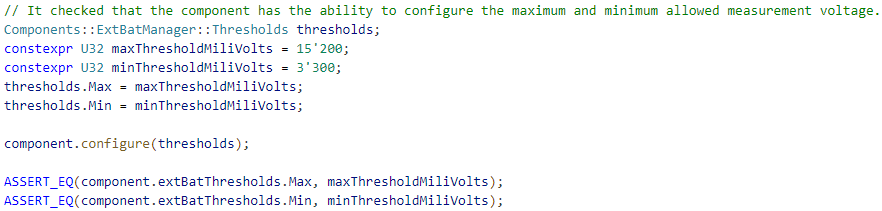
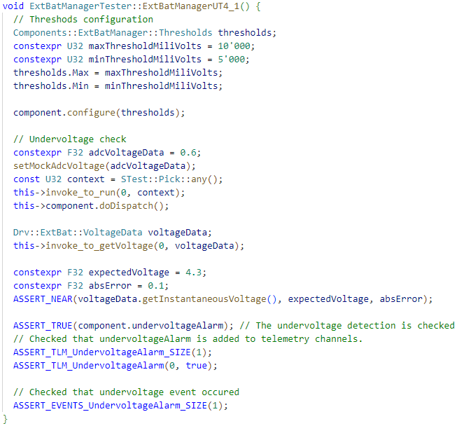
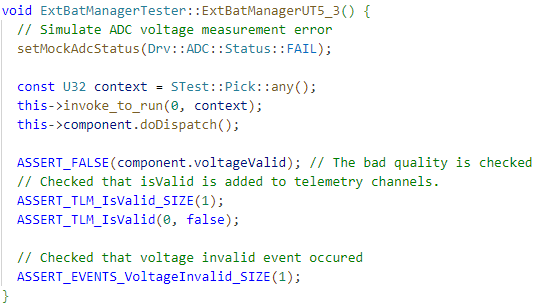
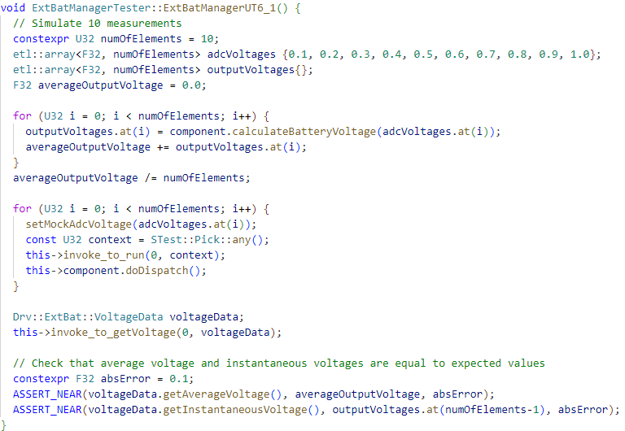

# Unit testing guide

## References
[Unit Testing in F´](https://nasa.github.io/fprime/UsersGuide/user/unit-testing.html)

[Writing Unit Tests Example](https://fprime-community.github.io/fprime-tutorial-math-component/#writing-unit-tests-part-1-creating-the-implementation-stub)

[GoogleTest User’s Guide](https://google.github.io/googletest/)

## I Creating the Implementation Stub
1. Generate Unit Test build cache:
```
fprime-util generate --ut 
```

2. Generate the Unit Test Stub for chosen component (for example ExtBatManager):
```
cd Components/ExtBatManager 
```
```
fprime-util impl --ut
```

3. Inside Components/ExtBatManager create test/ut folder:
```
mkdir test
```
```
mkdir test/ut
```

4. Put generated files at stage 2 in test/ut, so that folder structure is:



5. Add the Tests to the Build:

Inside ExtBatManager/CMakeLists.txt:

```
set(UT_MOD_DEPS
  Fw/Test
  STest
)

### UTs ###
set(UT_SOURCE_FILES
  "${CMAKE_CURRENT_LIST_DIR}/ExtBatManager.fpp"
  "${CMAKE_CURRENT_LIST_DIR}/test/ut/ExtBatManagerTester.cpp"
  "${CMAKE_CURRENT_LIST_DIR}/test/ut/ExtBatManagerTesterHelpers.cpp"
  "${CMAKE_CURRENT_LIST_DIR}/test/ut/ExtBatManagerTestMain.cpp"
)

register_fprime_ut()
```

6. Build the component's unit test (inside Components/ExtBatManager):
```
fprime-util build --ut 
```

7. To run tests:
```
fprime-util check
```

8. (Optional) Before regenerating of the project or if there is need to clean project use:
```
fprime-util purge --ut 
```

## II Requirements fulfillment

1. Look at component requirements (docs/sdd.md):



There are 6 requirements and they need be validated by unit testing.

2. Fulfill ExtBatManagerReq1

"The component must monitor the external battery voltage measurement (separate ADC input of the main microcontroller) by interacting with the ADC0Driver and add the measured voltage to the summary diagnostics and telemetry frame"

External battery voltage measurement is performed through getVoltageValue port. Proper mocking functions are needed to simulate data retrieve from this port. This is performed with the usage of functions setMockAdcVoltage, setMockAdcStatus and variables adcVoltage, adcStatus:



Unit test to pass ExtBatManagerReq1 looks as follows:



Test consists of the several stages:
- Write value that will be returned during invocation of getVoltageValue port:
```
constexpr F32 adcVoltageData = 0.7;
setMockAdcVoltage(adcVoltageData);
```

- Invoke and dispatch run port:
```
const U32 context = STest::Pick::any();
this->invoke_to_run(0, context);
this->component.doDispatch();
```

- Get voltageData from input port getVoltage:
```
Drv::ExtBat::VoltageData voltageData;
this->invoke_to_getVoltage(0, voltageData);
```

- Check that received voltageData is equal to the expected value:
```
constexpr F32 expectedResult = 5.0;
constexpr F32 absError = 0.1;

// Checked the ability to retrieve properly handled data and it can be added to the summary diagnostics by external component (which is out of scope of unit testing).
ASSERT_NEAR(voltageData.getInstantaneousVoltage(), expectedResult, absError);
```
expectedResult = 5.0 in accordance to the components formula that is implemented in insided calculateBatteryVoltage:  maxBatteryVoltage * inputVoltage / maxInputVoltage, where maxBatteryVoltage = 16.8, maxInputVoltage = 2.333 and inputVoltage = adcVoltageData = 0.7 as it is set at the beginning of the test.

- Checked that measured value is added to telemetry channels.
```
ASSERT_TLM_InstantaneousVoltage_SIZE(1);
ASSERT_TLM_AverageVoltage_SIZE(1);
```

3. Fulfill ExtBatManagerReq2

"The component should measure the external battery voltage at least every 200 ms."

Frequency of run port invocation depends on Rate Group component that connects to it. There wasn't found way to write proper unit test for this requirement. Probably it must be validated during integration testing.

4. Fulfill ExtBatManagerReq3

"The component shall provide the ability to configure the maximum and minimum allowed measurement voltage."

Unit test to pass ExtBatManagerReq3 looks as follows:



Test consists of the several stages:

- set thresholds to configuration:
```
Components::ExtBatManager::Thresholds thresholds;
constexpr U32 maxThresholdMiliVolts = 15'200;
constexpr U32 minThresholdMiliVolts = 3'300;
thresholds.Max = maxThresholdMiliVolts;
thresholds.Min = minThresholdMiliVolts;

component.configure(thresholds);
```

- assert that internal variables that are responsible for thresholds are equal to set values:
```
ASSERT_EQ(component.extBatThresholds.Max, maxThresholdMiliVolts);
ASSERT_EQ(component.extBatThresholds.Min, minThresholdMiliVolts);
```

5. Fulfill ExtBatManagerReq4

"The component must detect the output of the battery voltage beyond the maximum and minimum allowed for measurement. In case of reaching the limits of the maximum and minimum allowed battery voltage, it should generate the appropriate alarm status flag - Overvoltage Alarm, Undervoltage Alarm."

This requirements is fulfilled with 2 unit tests: ExtBatManagerUT4_1 and ExtBatManagerUT4_2.

ExtBatManagerUT4_1 looks as follows:



Test ExtBatManagerUT4_1 consists of the several stages: 
- Configure thresholds:
```
Components::ExtBatManager::Thresholds thresholds;
constexpr U32 maxThresholdMiliVolts = 10'000;
constexpr U32 minThresholdMiliVolts = 5'000;
thresholds.Max = maxThresholdMiliVolts;
thresholds.Min = minThresholdMiliVolts;

component.configure(thresholds);
```

- Simulate voltage that is under min threshold:
```
constexpr F32 adcVoltageData = 0.6;
setMockAdcVoltage(adcVoltageData);
const U32 context = STest::Pick::any();
this->invoke_to_run(0, context);
this->component.doDispatch();

Drv::ExtBat::VoltageData voltageData;
this->invoke_to_getVoltage(0, voltageData);

constexpr F32 expectedVoltage = 4.3;
constexpr F32 absError = 0.1;
ASSERT_NEAR(voltageData.getInstantaneousVoltage(), expectedVoltage, absError);
```

- Check undervoltageAlarm variable is true, UndervoltageAlaram telemetry is updated and equal to true and that UndervoltageAlarm event occured:
```
ASSERT_TRUE(component.undervoltageAlarm); // The undervoltage detection is checked
// Checked that undervoltageAlarm is added to telemetry channels.
ASSERT_TLM_UndervoltageAlarm_SIZE(1);
ASSERT_TLM_UndervoltageAlarm(0, true);
// Checked that undervoltage event occured
ASSERT_EVENTS_UndervoltageAlarm_SIZE(1);
```

Test ExtBatManagerUT4_2 similar to Test ExtBatManagerUT4_1 despite that overvoltage is checked.

6. Fulfill ExtBatManagerReq5

"The component should reset the quality of the measured voltage to “bad” in the following cases: voltage out of the permitted limits, hardware errors of the ADC during voltage measurement."

This requirements is fulfilled with 3 unit tests: ExtBatManagerUT5_1, ExtBatManagerUT5_2 and ExtBatManagerUT5_3.

ExtBatManagerUT5_1 and ExtBatManagerUT5_2 are created on similar principles as ExtBatManagerUT4_1 and ExtBatManagerUT4_2.

Unit test ExtBatManagerUT5_3 looks as follows:



Test consists of the several stages:

- Simulate ADC voltage measurement error
```
setMockAdcStatus(Drv::ADC::Status::FAIL);
```

- Invoke and dispatch run port:
```
const U32 context = STest::Pick::any();
this->invoke_to_run(0, context);
this->component.doDispatch();
```

- Assert that entities related to voltage validity has proper values:
```
ASSERT_FALSE(component.voltageValid);
ASSERT_TLM_IsValid_SIZE(1);
ASSERT_TLM_IsValid(0, false);
ASSERT_EVENTS_VoltageInvalid_SIZE(1);
```

7. Fulfill ExtBatManagerReq6

"The component shall provide instantaneous and average values of the measured voltage. The average value shall be calculated as a moving average of the last 10 measurements."

This requirements is fulfilled with 2 unit tests: ExtBatManagerUT6_1, ExtBatManagerUT6_2.

Unit test ExtBatManagerUT6_1 looks as follows:



Test consists of the several stages:

- Create and fill simulated and expected data:
```
constexpr U32 numOfElements = 10;
etl::array<F32, numOfElements> adcVoltages {0.1, 0.2, 0.3, 0.4, 0.5, 0.6, 0.7, 0.8, 0.9, 1.0};
etl::array<F32, numOfElements> outputVoltages{};
F32 averageOutputVoltage = 0.0;

for (U32 i = 0; i < numOfElements; i++) {
  outputVoltages.at(i) = component.calculateBatteryVoltage(adcVoltages.at(i));
  averageOutputVoltage += outputVoltages.at(i);
}
averageOutputVoltage /= numOfElements;
```

- Simulate 10 measurements:
```
for (U32 i = 0; i < numOfElements; i++) {
  setMockAdcVoltage(adcVoltages.at(i));
  const U32 context = STest::Pick::any();
  this->invoke_to_run(0, context);
  this->component.doDispatch();
}
```

- Receive voltage data:
```
Drv::ExtBat::VoltageData voltageData;
this->invoke_to_getVoltage(0, voltageData);
```

- Check that voltages are equal to expected values:
```
constexpr F32 absError = 0.1;
ASSERT_NEAR(voltageData.getAverageVoltage(), averageOutputVoltage, absError);
ASSERT_NEAR(voltageData.getInstantaneousVoltage(), outputVoltages.at(numOfElements-1), absError);
```

ExtBatManagerUT6_2 is similar to ExtBatManagerUT6_1 despite simulated data is randomized.